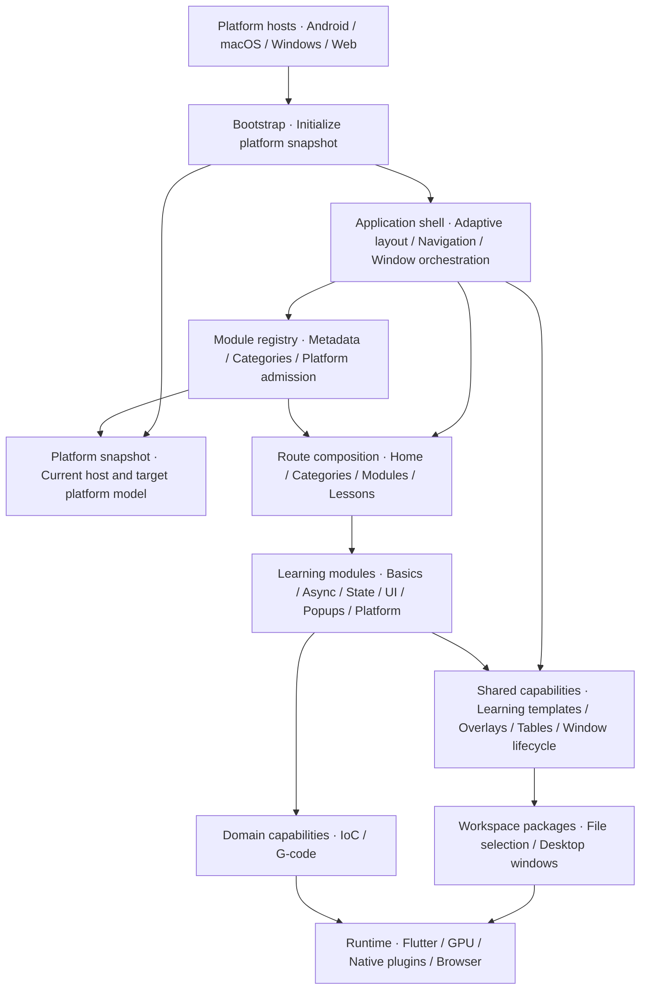
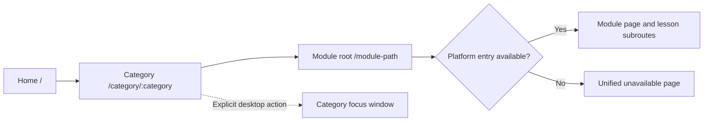

# Flutter Forge

[简体中文](README.md) · **English**

> Cross-platform Flutter engineering: architecture, graphics, and performance governance.

**24 learning modules across six categories** bring Flutter fundamentals, concurrency, state management, graphics, and native capabilities together under a shared application shell, module contracts, and quality gates.

[Try it online](https://lizy-coding.github.io/flutter_forge/) · [Demo video](https://github.com/user-attachments/assets/6af279c0-7d82-42bc-81b1-624071b0e2ea) · [Architecture decisions](docs/adr/README.md) · [Development guide](docs/DEVELOPMENT.md)


## Core design

- **Cross-platform consistency**: shared catalogs and routes, navigation that adapts to window space, and platform capabilities behind adapters.
- **Clear architecture boundaries**: the application shell owns navigation, the registry owns module metadata, and independent learning modules reuse shared capabilities and packages.
- **Graphics and performance practice**: 2D drawing, animation, 3D, and toolpath visualization, with concurrency and implementation comparisons to explore execution, rebuild, and drawing costs.
- **Sustainable governance**: generated contracts, static analysis, behavior tests, and resource lifecycle checks constrain changes.

## Architecture



Arrows show the main startup, composition, and capability usage relationships. Bootstrap creates the platform snapshot; the registry supplies module declarations used to compose routes and unavailable pages. Modules reuse shared capabilities and independent packages, while host differences stay within platform adapters.

### Project hierarchy

```text
flutter_forge/
├── apps/flutter_forge/           Application and Android / macOS / Windows / Web hosts
│   └── lib/
│       ├── app/                  Bootstrap, application shell, and window orchestration
│       │   └── router/           Home → Category → Module → Lesson
│       ├── module_registry/      Module metadata, catalog, and platform checks
│       ├── modules/              Independent learning modules
│       │   ├── basic/            Flutter fundamentals
│       │   ├── async/            Asynchronous work and concurrency
│       │   ├── state/            Architecture and state
│       │   ├── ui/               Graphics and interaction
│       │   ├── popup_table/      Popups and tables
│       │   └── platform/         Networking and platform capabilities
│       └── shared/               Learning templates, overlays, tables, and window lifecycle
├── packages/                     Reusable workspace packages
│   ├── flutter_ioc_core/         Pure Dart dependency injection
│   ├── file_picker_bridge/       File selection adapters
│   └── desktop_multi_window/     Desktop multi-window support
├── docs/                         Architecture decisions, development, and acceptance records
└── tool/                         Contract generation, tests, and quality gates
```

The application shell composes the system, and the registry drives both catalogs and routes. Modules do not depend on one another; the shared layer does not depend on the application shell or modules. `gcode_core` is integrated as an independent Git dependency.

Module declarations, route composition, and Agent contracts share a [generation source](tool/generate_agent_indexes.js). Platform admission and learning status are modeled separately; new modules follow the same contract and navigation structure.

## Routing and cross-platform navigation



The diagram shows the page navigation flow. Categories organize modules, while modules use independent root paths such as `/tree-state` and `/flutter-scene-3d`. Lessons sit below module paths, for example `/microtask/event-queue`. The main window shares a navigation shell through GoRouter's `ShellRoute`; restricted modules retain their root entry and explanation page, without registering internal subroutes.

Navigation adapts to available width: **Drawer below 600dp, NavigationRail at 600–1023dp, and a collapsible sidebar from 1024dp**. Categories open within the application by default. Wide desktop windows with multi-window capability can explicitly open and reuse category focus windows. See the [navigation decision](docs/adr/0012-adaptive-navigation-shell.md).

The repository contains Android, macOS, Windows, and Web hosts. iOS is part of the platform model, with no host or build evidence yet. Entry availability, successful builds, and real-device acceptance are recorded separately; see the [platform contract](docs/adr/0011-platform-snapshot-and-guarded-routes.md) and [acceptance reports](docs/reports/).

## Learning map

| Area | Representative content |
|---|---|
| [Fundamentals · 3](apps/flutter_forge/lib/modules/basic/) | The three trees and lifecycle, event loop, debounce and throttle |
| [Concurrency · 3](apps/flutter_forge/lib/modules/async/) | Streams, Isolate comparisons, task and progress management |
| [Architecture and state · 3](apps/flutter_forge/lib/modules/state/) | State management approaches, IoC lifecycles, local persistence |
| [Graphics and interaction · 5](apps/flutter_forge/lib/modules/ui/) | Snapping canvas, download animation, fonts, 3D viewer, G-code toolpaths |
| [Popups and tables · 4](apps/flutter_forge/lib/modules/popup_table/) | Popup composition, two-dimensional tables, Overlay following comparisons |
| [Networking and platform · 6](apps/flutter_forge/lib/modules/platform/) | Request interceptors, files, video, WebView, BLE, USB |

Suggested starting path: **Three trees → Event loop → Streams → State management**. [Module declarations](apps/flutter_forge/lib/module_registry/module_manifest.dart) define platform restrictions: Isolate modules are unavailable on Web, G-code is macOS-only, and USB functionality remains disabled. The Android 3D entry is automatic view-only playback; Windows and Android builds and GPU first-frame acceptance still require separate evidence.

## Getting started

Flutter `>=3.47.2` · Dart `^3.11.5`

```bash
# Resolve workspace dependencies from the repository root
flutter pub get
cd apps/flutter_forge
flutter run -d <device>
```

Run from the repository root:

```bash
bash tool/quality_gate.sh       # Contracts, formatting, analysis, all tests, layout, FlutterGuard
bash tool/build_web_release.sh  # Web Release and resource checks
```

<details>
<summary>Hosting and releases</summary>

[GitHub Pages](.github/workflows/deploy-pages.yml) and [Cloudflare Pages](.github/workflows/deploy-cloudflare-pages.yml) use independent workflows, with build base paths `/flutter_forge/` and `/`, respectively.

Cloudflare uses a Direct Upload project named `flutter-forge` with production branch `dev`. Configure a token with Pages: Edit permission, secrets `CLOUDFLARE_API_TOKEN` / `CLOUDFLARE_ACCOUNT_ID`, and variable `CLOUDFLARE_PAGES_ENABLED=true`. The workflow checks the 25 MiB per-file limit before upload; verify deep links and media resources after deployment.

CI builds staging artifacts. GitHub Releases use Agent Hub `release_hosting` through `release-plan` / `release-run --execute`. Distribution formats are macOS DMG, Windows EXE, Android ARM64 debug APK, and Web static files.

</details>

## Development and documentation

Changes go to `dev` first; `master` accepts changes only through PRs from `dev`. New modules must update the registration source, learning templates, contracts, and tests, and pass the full quality gate.

[Development guide](docs/DEVELOPMENT.md) · [Testing](docs/TESTING.md) · [Architecture decisions](docs/adr/README.md) · [Acceptance rules](docs/QUALITY_ACCEPTANCE.md) · [Agent rules](AGENTS.md)

---

Maintained by [Lizy](https://github.com/lizy-coding), focused on cross-platform Flutter and engineering architecture. [Juejin](https://juejin.cn/user/2085122730895063/posts) · [Yuque](https://www.yuque.com/diligent_coding/flutter)
