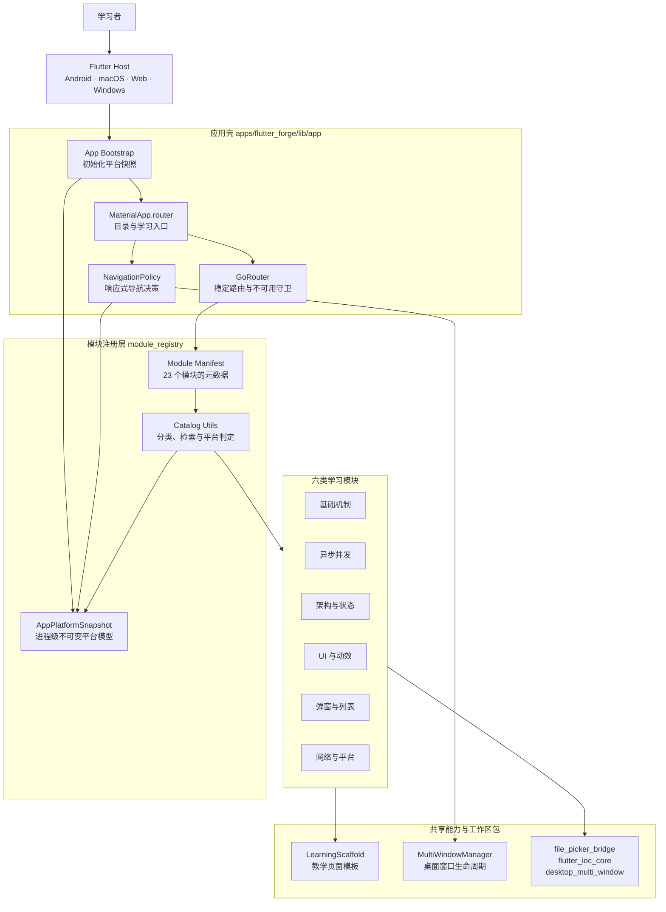
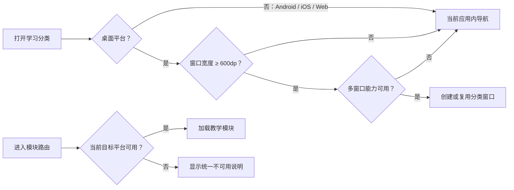

# Flutter Forge

> 把 Flutter 的底层机制、工程架构与跨平台能力，变成可以运行、交互、对照和验证的学习现场。

Flutter Forge 不是零散 Demo 的陈列柜，而是一座面向真实工程的 Flutter 学习工坊。项目将三棵树、事件循环、Isolate、状态管理、动效、3D、网络、文件选择、视频与原生能力组织为 **23 个可注册学习模块**；每个模块都带有学习语义、平台边界和独立测试，并运行在同一套响应式导航、模块注册与质量门禁之上。

[在线体验 Flutter Forge Web](https://lizy-coding.github.io/flutter_forge/)


完整演示视频：https://github.com/user-attachments/assets/6af279c0-7d82-42bc-81b1-624071b0e2ea

## 为什么是 Flutter Forge

- **从“看代码”到“看见机制”**：用可操作页面展示重建、队列调度、流订阅、并发、状态流转、绘制与平台调用。
- **从单页示例到工程系统**：模块通过统一注册表进入目录与路由，共享能力有明确边界，不靠复制粘贴拼装功能。
- **从“能运行”到“知道在哪里能运行”**：平台支持与学习质量分开建模；不支持的能力仍保留在目录中，并给出明确说明。
- **从一次演示到可持续演进**：机器可解析的 Agent 契约、生成校验、静态分析、全量测试和 FlutterGuard 共同守住变更质量。

## 系统全景



这套结构把职责切成四层：应用壳负责启动与导航，注册层负责模块事实与平台判定，模块层只承载学习内容和局部状态，共享层提供业务无关能力。普通模块不直接决定平台目录可见性，也不拥有多窗口策略。

### 导航与平台决策



Android、iOS 与 Web 始终使用应用内导航；桌面端只有在宽窗口且多窗口能力可用时才创建分类窗口。模块路径保持稳定，平台受限模块会进入统一说明页，而不是消失或落入 404。

## 学习地图

| 主题 | 代表模块 | 你会观察到什么 |
|------|----------|----------------|
| 基础机制 | 三棵树与生命周期、事件循环、防抖与节流 | Widget/Element/RenderObject 关系、任务队列与调用时序 |
| 异步并发 | Stream 订阅、Isolate 对比、多任务管理器 | 背压、生命周期、主线程响应与跨 Isolate 通信 |
| 架构与状态 | 状态管理演进、Flutter IoC、本地持久化 | setState 到 Bloc 的取舍、依赖作用域与状态恢复 |
| UI 与动效 | 智能吸附线、下载动效、字体选择器、3D 查看器、G-code | 绘制、手势、Overlay、相机控制与 GPU 场景 |
| 弹窗与列表 | 弹窗合集、二维滚动表格、Overlay 跟随对照 | 浮层定位、嵌套路由与二维滚动布局 |
| 网络与平台 | Dio 拦截器、文件选择、在线视频、WebView、USB | 请求链路、原生边界、媒体生命周期与不可用降级 |

推荐从“三棵树与生命周期”开始，依次进入事件循环、Stream、Isolate、状态管理，再探索 UI/3D 与平台能力。目录中的难度、预计用时、概念标签和学习状态可以帮助你自行调整路线。

## 平台边界

Flutter Forge 的目标平台模型覆盖 Android、iOS、macOS、Web 和 Windows，但“进入目标集合”不等于所有能力都已完成真机验收。

| 平台 | 当前仓库能力边界 |
|------|------------------|
| macOS | 桌面主线；支持宽窗口分类多窗口，部分 GPU/原生模块以 macOS 为已接入基线 |
| Windows | 桌面主线；核心真机能力已有记录，多窗口专项仍以验收报告为准 |
| Android | 单窗口兼容轨道；构建、模拟器遍历与基础原生通道已有证据，USB/键盘等真机行为仍需设备验收 |
| Web | 单窗口浏览器交付；Safari/Chrome 已覆盖主体模块，原生 WebView、USB、G-code 与 Isolate 模块保留不可用态 |
| iOS | 已进入平台判定模型；当前仓库没有 iOS Host 与构建证据，不应视为已交付 |

运行时以 `ModulePlatformSupport` 的排除集合描述平台限制，目录与路由统一通过 `module_registry` 判定。学习质量状态（`pending` / `ready` / `recommended`）不用于表达平台支持。

详细证据见 [`docs/reports/`](docs/reports/)；分层验收规则见 [`docs/QUALITY_ACCEPTANCE.md`](docs/QUALITY_ACCEPTANCE.md)。

## 快速开始

环境要求：Flutter `>=3.47.2`、Dart `^3.11.5`。

```bash
# 在仓库根目录解析 Pub Workspace
flutter pub get

# 启动主应用
cd apps/flutter_forge
flutter run -d <device>
```

Web Release 使用仓库提供的受检脚本，确保本地 CanvasKit、启动壳与同源媒体契约一致：

```bash
bash tool/build_web_release.sh
```

提交变更前执行完整门禁：

```bash
bash tool/quality_gate.sh
```

门禁会依次检查 Agent 文档漂移、Dart 格式、bare `flutter analyze`、全部测试、测试目录布局和 FlutterGuard HIGH 问题。

## 仓库结构

```text
flutter_forge/
├── apps/flutter_forge/              # Flutter 应用与各平台 Host
│   ├── lib/app/                      # 启动、应用壳、路由与导航策略
│   ├── lib/module_registry/          # 模块元数据、平台快照与目录操作
│   ├── lib/shared/                   # 教学模板与业务无关的共享能力
│   └── lib/modules/                  # 六类、23 个学习模块
├── packages/
│   ├── file_picker_bridge/           # 跨平台文件选择边界
│   ├── flutter_ioc_core/             # 纯 Dart IoC 核心
│   └── desktop_multi_window/         # 桌面多窗口插件与本地修复
├── docs/adr/                          # 架构决策记录
├── docs/reports/                      # 分平台验收证据
├── tool/                              # 契约生成、测试与质量门禁
├── AI_PROJECT_CONTEXT.md              # 机器可解析项目契约
└── REFACTOR_PLAN.md                   # 机器可解析演进队列
```

`gcode_core` 作为独立 Git 依赖维护；Canvas、时间线和播放控件由它提供，教学编排与文件选择留在 Flutter Forge。工作区包禁止使用指向仓库外部的 `path: ../...` 依赖。

## 如何新增或修改模块

每个学习模块都不是孤立页面，而是一个受契约约束的可注册单元：

1. 使用 `module_entry.dart` 暴露 `*Entry` Widget。
2. 在模块注册源中补全标题、副标题、分类、难度、概念、预计用时和状态。
3. 至少使用一个 `lib/shared/learning` 教学模板组件。
4. 维护模块 `AI_ANALYSIS.md`，并通过生成脚本校验机器契约。
5. 为逻辑、交互和平台分支补充对应测试。
6. 执行 `bash tool/quality_gate.sh`，涉及教学 UI 时补充人工验收或截图说明。

完整规则以 [`AGENTS.md`](AGENTS.md) 为准。架构与平台变更还应先阅读 [`CONTEXT.md`](CONTEXT.md) 和相关 [`docs/adr/`](docs/adr/)。

## 协作与分支

- `dev` 是持续开发分支，功能、修复、文档与发版准备先进入 `dev`。
- `master` 是受保护稳定分支，只能通过从 `dev` 发起的 Pull Request 合入。
- 不直接推送、强制推送或删除 `master`；合入后将合并拓扑同步回 `dev`。
- 提交信息采用 `<type>(<scope>): <subject>`，常用类型包括 `feat`、`fix`、`docs`、`refactor`、`test` 和 `chore`。

发布不由业务仓库 CI 直接创建 GitHub Release；发布计划与执行统一经 Agent Hub 的 `release_hosting` 流程完成。
