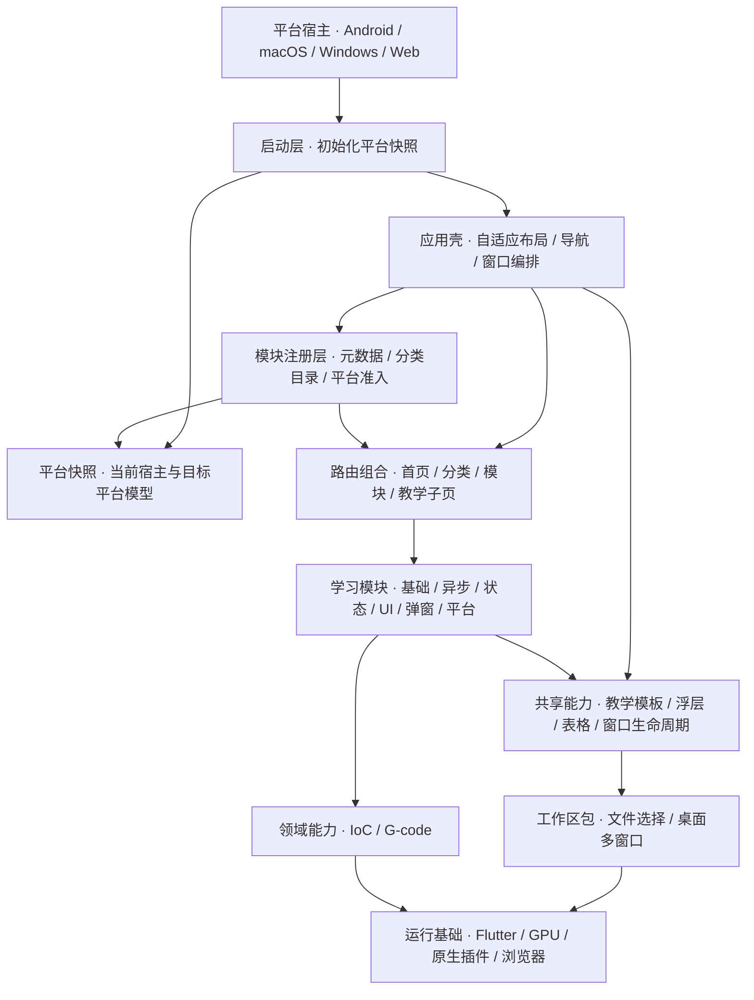
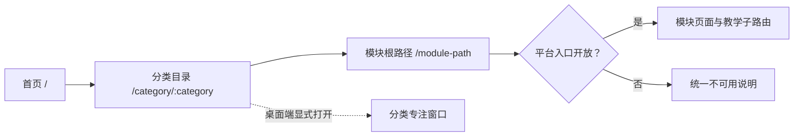

# Flutter Forge

**简体中文** · [English](README.en.md)

> 跨平台 Flutter 工程实践：架构设计、图形绘制与性能治理。

将基础机制、异步并发、状态管理、绘制交互和原生能力整合为 **六类、24 个学习模块**，在同一套应用壳、模块契约和质量门禁下持续演进。

[在线体验](https://lizy-coding.github.io/flutter_forge/) · [演示视频](https://github.com/user-attachments/assets/6af279c0-7d82-42bc-81b1-624071b0e2ea) · [架构决策](docs/adr/README.md) · [开发指南](docs/DEVELOPMENT.md)


## 核心设计

- **跨平台一致性**：共享目录与路由，按窗口空间调整导航，平台能力通过适配层接入。
- **清晰的架构边界**：应用壳管理导航，注册层维护模块事实，学习模块彼此独立，共享能力与基础包复用。
- **绘制与性能实践**：覆盖 2D 绘制、动效、3D 和轨迹可视化，通过并发与方案对照观察执行、重建和绘制成本。
- **可持续治理**：生成式契约、静态分析、行为测试与资源生命周期检查共同约束变更。

## 整体架构


```mermaid
flowchart TB
    Host["平台宿主 · Android / macOS / Windows / Web"] --> Boot["启动层 · 初始化平台快照"]
    Boot --> App["应用壳 · 自适应布局 / 导航 / 窗口编排"]
    Boot --> Platform["平台快照 · 当前宿主与目标平台模型"]
    App --> Registry["模块注册层 · 元数据 / 分类目录 / 平台准入"]
    Registry --> Platform
    App --> Routes["路由组合 · 首页 / 分类 / 模块 / 教学子页"]
    Registry --> Routes
    Routes --> Modules["学习模块 · 基础 / 异步 / 状态 / UI / 弹窗 / 平台"]
    App --> Shared["共享能力 · 教学模板 / 浮层 / 表格 / 窗口生命周期"]
    Modules --> Shared
    Shared --> Packages["工作区包 · 文件选择 / 桌面多窗口"]
    Modules --> Core["领域能力 · IoC / G-code"]
    Packages --> Runtime["运行基础 · Flutter / GPU / 原生插件 / 浏览器"]
    Core --> Runtime
```

图中箭头表示主要的启动、组装与能力使用关系。应用启动时建立平台快照；注册层提供统一模块声明，路由据此组装页面与不可用说明。模块复用共享能力和独立包，宿主差异留在平台适配边界内。

### 项目层级概要

```text
flutter_forge/
├── apps/flutter_forge/           应用与 Android / macOS / Windows / Web 宿主
│   └── lib/
│       ├── app/                  启动、应用壳与窗口编排
│       │   └── router/           首页 → 分类 → 模块 → 教学子页
│       ├── module_registry/      模块元数据、目录与平台判定
│       ├── modules/              独立学习模块
│       │   ├── basic/            基础机制
│       │   ├── async/            异步并发
│       │   ├── state/            架构与状态
│       │   ├── ui/               绘制与交互
│       │   ├── popup_table/      弹窗与列表
│       │   └── platform/         网络与平台
│       └── shared/               教学模板、浮层、表格与窗口生命周期
├── packages/                     可复用工作区包
│   ├── flutter_ioc_core/         纯 Dart 依赖注入
│   ├── file_picker_bridge/       文件选择适配
│   └── desktop_multi_window/     桌面多窗口
├── docs/                         架构决策、开发指南与验收记录
└── tool/                         契约生成、测试与质量门禁
```

应用壳负责组装，注册层统一驱动目录和路由；模块之间不直接依赖，共享层不反向依赖应用壳或模块。`gcode_core` 作为独立 Git 依赖接入。

模块声明、路由组合与 Agent 契约由 [生成源](tool/generate_agent_indexes.js)统一维护。平台准入和学习状态分别建模；新增模块沿用同一套契约，无需另建导航体系。

## 路由与跨平台导航


```mermaid
flowchart LR
    Home["首页 /"] --> Category["分类目录 /category/:category"]
    Category --> Entry["模块根路径 /module-path"]
    Entry --> Guard{"平台入口开放？"}
    Guard -->|是| Module["模块页面与教学子路由"]
    Guard -->|否| Unavailable["统一不可用说明"]
    Category -. 桌面端显式打开 .-> Window["分类专注窗口"]
```

图中展示页面访问流程：分类组织模块，模块使用独立根路径，如 `/tree-state`、`/flutter-scene-3d`；教学子页位于模块路径下，如 `/microtask/event-queue`。主窗口通过 GoRouter `ShellRoute` 共享导航外壳；受限模块保留根入口和说明页，不注册内部子路由。

导航随可用宽度切换：**小于 600dp 使用 Drawer，600–1023dp 使用 NavigationRail，1024dp 起使用可折叠侧栏**。分类默认在应用内打开；桌面宽窗口且能力可用时，可显式打开并复用分类专注窗口。详见 [导航决策](docs/adr/0012-adaptive-navigation-shell.md)。

仓库已包含 Android、macOS、Windows、Web 宿主；iOS 仅纳入平台模型，尚无宿主与构建证据。模块入口开放、构建通过和真实设备验收分别记录，参见 [平台契约](docs/adr/0011-platform-snapshot-and-guarded-routes.md)与 [验收报告](docs/reports/)。

## 内容地图

| 方向 | 代表内容 |
|---|---|
| [基础机制 · 3](apps/flutter_forge/lib/modules/basic/) | 三棵树与生命周期、事件循环、防抖与节流 |
| [异步并发 · 3](apps/flutter_forge/lib/modules/async/) | Stream、Isolate 对比、多任务与进度管理 |
| [架构与状态 · 3](apps/flutter_forge/lib/modules/state/) | 状态管理演进、IoC 生命周期、本地持久化 |
| [绘制与交互 · 5](apps/flutter_forge/lib/modules/ui/) | 吸附画板、下载动效、字体、3D 查看器、G-code 轨迹 |
| [弹窗与列表 · 4](apps/flutter_forge/lib/modules/popup_table/) | 弹窗组合、二维表格、Overlay 跟随方案对照 |
| [网络与平台 · 6](apps/flutter_forge/lib/modules/platform/) | 请求拦截、文件、视频、WebView、BLE、USB |

入门建议：**三棵树 → 事件循环 → Stream → 状态管理**。平台限制以 [模块声明](apps/flutter_forge/lib/module_registry/module_manifest.dart)为准：Isolate 在 Web 不可用，G-code 仅开放 macOS，USB 功能暂不开放；3D 的 Android 入口仅自动巡展，Windows / Android 构建与 GPU 首帧验收仍需独立证据。

## 快速开始

Flutter `>=3.47.2` · Dart `^3.11.5`

```bash
# 仓库根目录解析工作区依赖
flutter pub get
cd apps/flutter_forge
flutter run -d <device>
```

在仓库根目录执行：

```bash
bash tool/quality_gate.sh       # 契约、格式、分析、全量测试、布局与 FlutterGuard
bash tool/build_web_release.sh  # Web Release 与资源检查
```

<details>
<summary>托管与发布</summary>

[GitHub Pages](.github/workflows/deploy-pages.yml) 与 [Cloudflare Pages](.github/workflows/deploy-cloudflare-pages.yml) 使用独立流程，构建基路径分别为 `/flutter_forge/` 和 `/`。

Cloudflare 使用名为 `flutter-forge` 的 Direct Upload 项目（生产分支 `dev`）；配置 Pages: Edit 权限的 Token、secrets `CLOUDFLARE_API_TOKEN` / `CLOUDFLARE_ACCOUNT_ID` 和 variable `CLOUDFLARE_PAGES_ENABLED=true`。上传前检查 25 MiB 单文件限制，部署后验证深层路由与媒体资源。

CI 构建暂存产物；GitHub Release 经 Agent Hub `release_hosting` 的 `release-plan` / `release-run --execute` 发布。分发形式为 macOS DMG、Windows EXE、Android ARM64 debug APK 与 Web 静态文件。

</details>

## 开发与文档

开发变更先进入 `dev`，`master` 仅通过从 `dev` 发起的 PR 合入。新增模块需同步注册源、教学模板、模块契约与测试，并通过完整门禁。

[开发指南](docs/DEVELOPMENT.md) · [测试说明](docs/TESTING.md) · [架构决策](docs/adr/README.md) · [验收规则](docs/QUALITY_ACCEPTANCE.md) · [Agent 规则](AGENTS.md)

---

由 [Lizy](https://github.com/lizy-coding) 维护，专注 Flutter 跨平台与工程架构。 [掘金](https://juejin.cn/user/2085122730895063/posts) · [语雀](https://www.yuque.com/diligent_coding/flutter)
