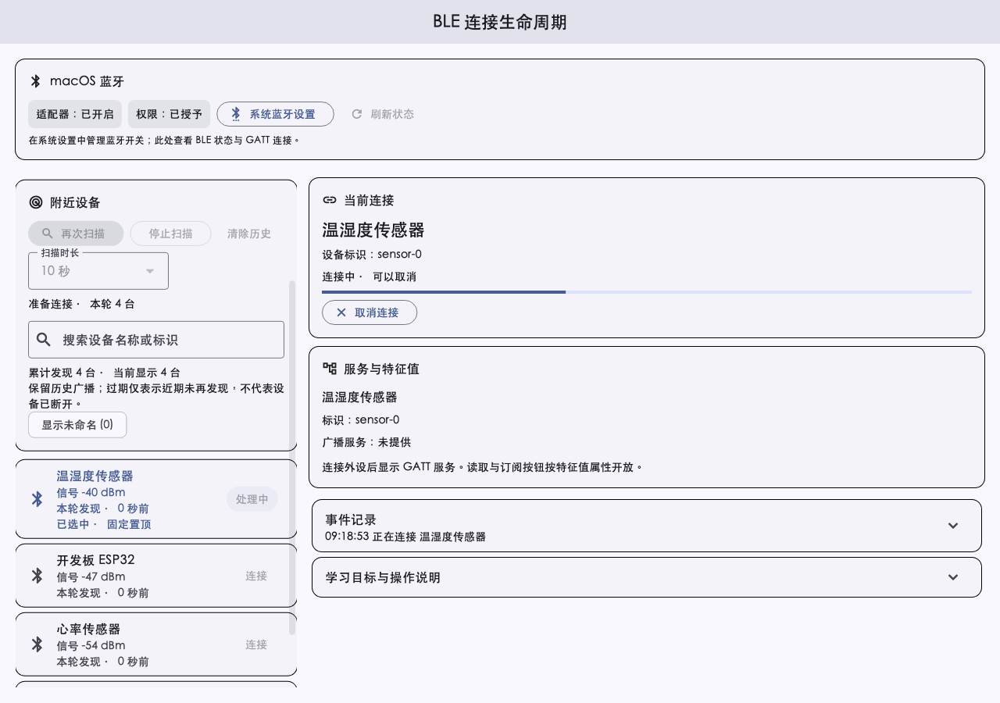
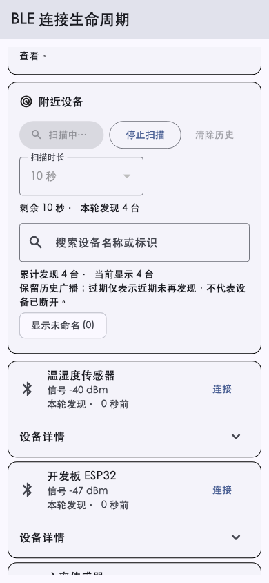

# BLE 扫描状态与可操控性 — 2026-10-02

## 基线与范围

本次基于本地 `dev` 的 `f799663`，改动前工作树干净，分支落后本地缓存 origin/dev 五个提交。未自动同步分支、提交或推送。本次优化通用 BLE 扫描与 GATT 生命周期，不扩大系统蓝牙控制能力，也不将 Windows 接入标为主机验收通过。

执行期间出现并行的应用主题、窗口生命周期与相关测试改动。本轮不接管这些改动；整仓门禁核对包含它们的当前工作区快照，BLE 定向结果单独记录。

## 用户操作

- 扫描时长可选 10/20/30 秒；显示倒计时、本轮发现数量、停止原因。
- 再次扫描保留历史结果，只有“清除历史”会移除；展示本轮发现、历史结果、广播过期和最近发现时间。
- 列表保持首次发现顺序，选中项置顶；RSSI 更新不重新排序，广播更新合并到 250ms 的刷新周期。
- 连接分为连接中、服务发现中、服务就绪；显示目标设备，连接或服务发现期间可以取消。
- 失败和意外断开提供重新连接；原生断开未确认时保留目标与待确认状态，提供重试确认断开。
- 停止扫描后核对插件 isScanning；断开后核对插件 connectionState。不会在请求发出时直接清除为成功状态。
- 取消、超时或离开页面后，迟到连接、扫描、服务发现和读取结果不回填旧页面状态；迟到原生连接/扫描会尝试释放，失败保留未确认说明。
- 权限检查阶段取消不会操作未由本应用发起的原生连接；重复特征值操作被抑制。
- 取消/断开与状态确认使用独立控制队列，避免在普通 GATT 操作后排队。
- 页面离开前台会请求停止扫描；保留当前连接时仍不同时发起扫描，这是当前应用策略。

广播过期只说明近期未收到广播，不代表设备已断开。系统连接查询依然受插件和平台范围限制。

## 验证

| 项目 | 结果与边界 |
| --- | --- |
| BLE 定向测试 | 37 项通过：状态阶段、取消、超时、迟到结果、原生停止/断开失败、重试、权限准备取消、历史过期、RSSI 顺序及小屏大字号 |
| 整仓质量门禁 | 6/6 全绿：通过临时 Git 索引核对当前混合工作区候选内容；不改变主索引，也不代表 Windows 或真实无线电验收 |
| Widget 渲染 | macOS 连接中/取消入口、Android 扫描中/计数/列表状态的 Fake 客户端预览已生成并检查 |
| macOS Debug 构建 | 构建成功，日志 `/private/tmp/forge-ble-controls-macos-build.log` |
| macOS 原生窗口 | 已从当前 Debug 应用实际进入 BLE 页面，看到新增扫描时长和状态控件 |
| macOS 真实扫描 | PENDING：插件状态读取 8 秒超时；TCC 日志确认本次 ad-hoc 签名与旧授权 code requirement 不匹配，系统要求重新授权 |
| 系统权限检查 | 系统设置显示旧 Flutter Forge 蓝牙权限开关已开启，但不证明当前签名已获授权；未修改此开关 |
| 授权提示自动操作 | 工具安全检查拒绝访问 `com.apple.UserNotificationCenter`，提示须由用户手动处理 |
| Windows/Android 实际设备 | PENDING：本轮未完成对应主机或真机的新流程验证 |

自动化测试中的 Fake 状态和 Widget 图片不是真实无线电或外设验收证据。

## 可重复的原生扫描流程

新增 `apps/flutter_forge/integration_test/ble_scan_controls_test.dart`，默认跳过；仅显式启用硬件验收时调用真实插件。

```bash
cd apps/flutter_forge
flutter test integration_test/ble_scan_controls_test.dart -d macos \
  --dart-define=BLE_HARDWARE_ACCEPTANCE=true
```

需要真实蓝牙适配器已开启，并由用户在系统中批准该构建的蓝牙访问。测试等待授权与状态就绪，然后执行扫描 → 手动停止并确认 → 再次扫描保留结果 → 再次停止。默认跳过不表示通过；本轮该原生流程仍 PENDING。

连接/取消、服务发现及通知的真实设备验收须使用明确归属的外设，分别记录平台结果。

## Widget 预览





## 本轮日志

- 定向测试：`/private/tmp/forge-ble-controls-tests.log`。
- 整仓门禁：`/private/tmp/forge-ble-controls-quality-gate.log`。
- macOS 应用日志：`/private/tmp/forge-ble-controls-native-log.txt`。
- TCC 诊断：`/private/tmp/forge-ble-controls-tcc-log.txt`。
