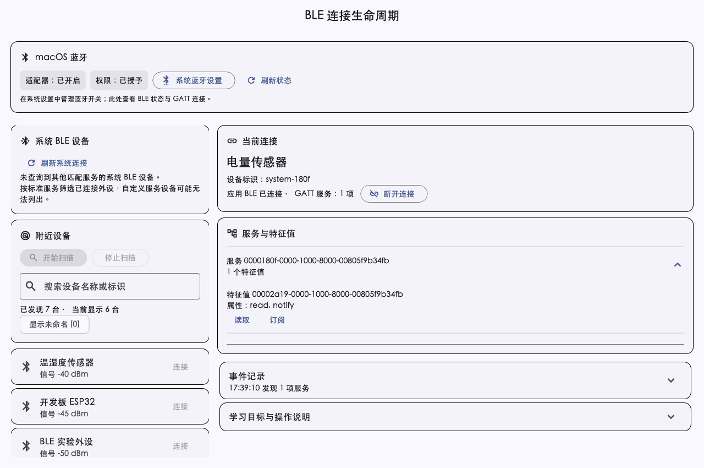
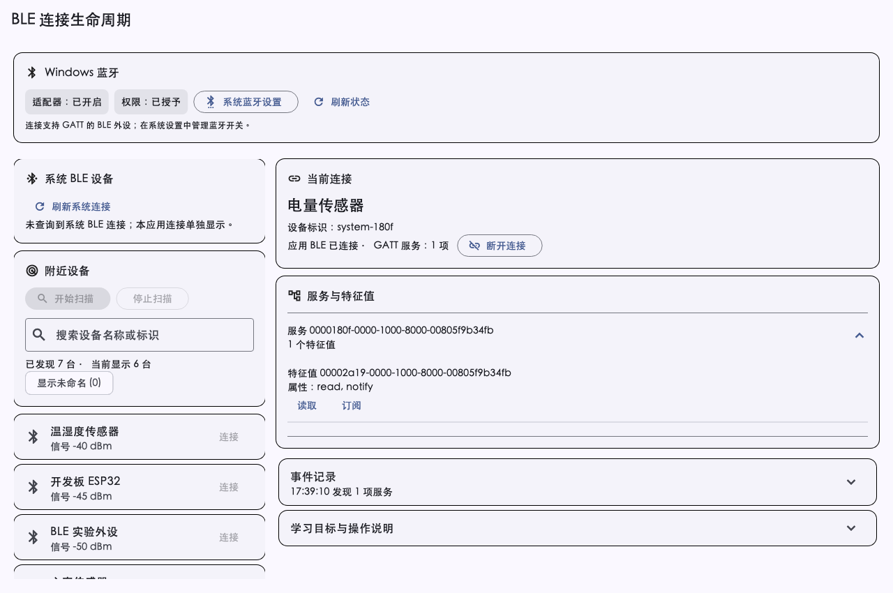

# BLE 分平台布局优化 — 2026-09-30

## 布局与能力

- 可用宽度至少 960dp、高度至少 560dp 且文字缩放适中时，使用设备列表与详情双栏；两栏独立滚动。
- 窄窗口、低高度窗口和大字号回到单栏；系统连接优先于扫描结果，已存在系统连接时合并空应用连接占位，减少移动端重复卡片。
- macOS：蓝牙状态与系统设置入口集中在顶部；系统查询提示其按标准服务筛选的范围，不用空结果声明系统没有连接设备。
- Windows：共用双栏工作区与系统设置入口；平台构建、真实设备与系统设置跳转继续 PENDING。
- Android：保留系统确认开启和系统设置关闭入口，连接列表与扫描操作按触控顺序组织。
- 附近设备按需渲染；桌面选择设备可在右侧查看标识与广播服务，移动端可展开设备详情。
- GATT 读取和通知仍按特征值属性开放；事件记录与教学说明折叠，保留 LearningObjectives 教学组件。

macOS/Windows 设置入口使用 url_launcher。macOS 使用 `x-apple.systempreferences:com.apple.BluetoothSettings`，Windows 使用 `ms-settings:bluetooth`；打开失败在页面显示错误，不声明系统开关已被切换。

## 验证边界

| 项目 | 证据 |
| --- | --- |
| 分平台 Widget 和行为测试 | 15 项，包括 macOS/Windows 双栏及设置操作、640dp 窄窗口、420dp 低高度、Android 320dp 和 1.6 倍文字缩放 |
| 六阶段质量门禁 | 6/6 全绿，临时 Git 索引核对当前候选源码；原暂存状态未改变 |
| 布局渲染检查 | 使用 FakeBleClient 的三端 Widget 预览，已查看 macOS、Windows 与 Android 布局；不是实际系统设备列表或真实主机截图 |
| macOS Debug 构建 | 构建成功；日志位于 `/private/tmp/forge-ble-layout-macos-build.log` |
| macOS 原生窗口交互 | PENDING：两次 CUA 启动均返回 `Sky Computer Use native pipe startup failed` |
| macOS 系统设置跳转 | PENDING：按钮行为有 Fake 客户端测试，真实系统设置面板尚未确认 |
| Windows 主机 | PENDING：当前仍在 macOS 上验证跨平台代码，不标记 Windows PASS |
| Android 真机改版验收 | PENDING：本轮只有 Widget 渲染和布局交互测试 |

## Widget 预览

## 人工验收

1. 在 macOS 真实窗口进入 BLE，调整宽度和高度，检查单栏/双栏切换及两栏独立滚动。
2. 点击系统设置入口，确认进入蓝牙面板；返回应用核对状态刷新。
3. 扫描并选择外设，检查设备详情、GATT 连接、展开服务、读取和订阅按钮、主动断开。
4. 在 Android 真机检查连接列表、扫描、搜索、大字号、键盘和折叠区域。
5. Windows 在真实主机独立完成构建和上述交互后再记录结果。
